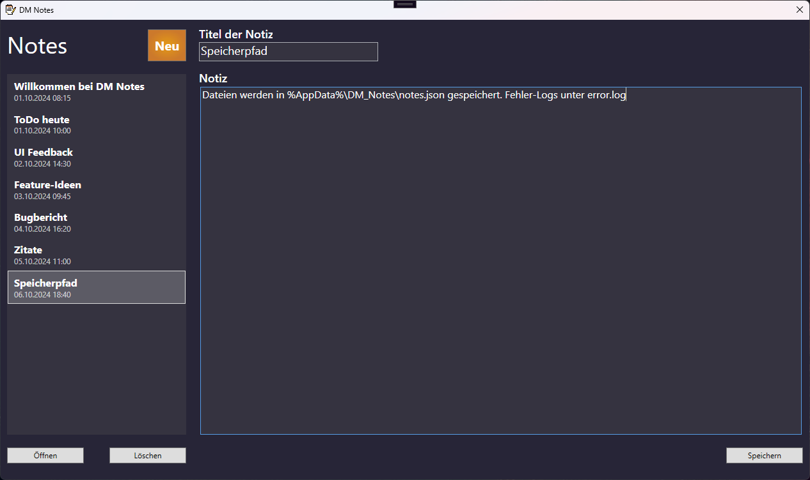
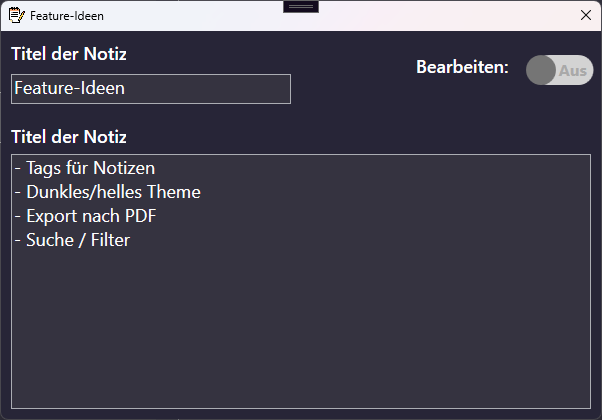

# DM Notes

A simple yet structured WPF application for creating and managing notes. Follows the MVVM (Model-View-ViewModel) architectural pattern, ensuring separation of concerns, testability, and scalability.

---

## Features
- Create, edit, delete notes
- Persist notes to local storage (JSON-based)
- MVVM architecture using ICommand and INotifyPropertyChanged
- Modular service abstraction with `INoteService`
- Simple UI with custom controls (e.g., SliderButton)
- Unit tests for ViewModel logic

---

## Project Structure
```text
DM_Notes/
│
├── MVVM/
│   ├── Model/              # Note model definition
│   ├── View/               # XAML views
│   └── ViewModel/          # ViewModel binding logic
│
├── Core/                  # Base classes like RelayCommand, NoteCollection
├── Services/              # Storage and adapter services
├── Controls/              # Custom UI controls
├── Resources/             # XAML styles
├── Images/                # Application icons
├── DM_Notes.Tests/        # Unit tests (NUnit)
└── MainWindow.xaml        # Root window UI
```

---

## Running Tests
```bash
# Run unit tests (requires .NET SDK)
dotnet test DM_Notes.Tests
```

---

## Build & Run
```bash
# Restore dependencies
dotnet restore

# Build the solution
dotnet build DM_Notes.sln

# Run the app
# (can also be opened with Visual Studio)
dotnet run --project DM_Notes
```

---

## Architecture Overview
- **MVVM Pattern:** Decouples UI from business logic.
- **RelayCommand:** Generic command binding with `ICommand`.
- **NoteServiceAdapter:** Intermediary between UI and persistence layer.
- **ErrorLogger:** Basic logging of exceptions.

---

## Requirements
- .NET Framework or .NET SDK (6.0+)
- Visual Studio or Rider (optional)

---

## Future Improvements
- Dependency Injection for Services
- SQLite integration instead of JSON
- Dark mode toggle
- Cloud synchronization (e.g., Google Drive API)
- More comprehensive test coverage

---

## Screenshots


